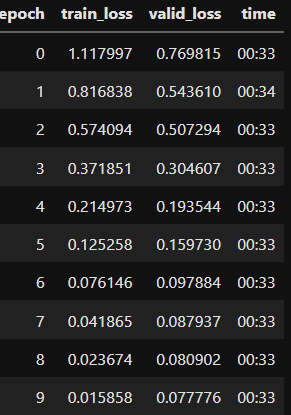

# Alzheimer's diagnosis using brain MRI
In this project, I made a model for Zamir diagnosis by using brain MRI data. The data I used for this project contained four classes :
1. Non Demented 
2. Moderate Demented 
3. Mild Demented 
4. Very Mild Demented


Project overview : 

## 1 - Load Images
convert images into batches, split validation data and resize images to 224 (w,h)


## 2- Import and train model 



## 4 - Save model

## 5 - Create a GUI 


## Run The Project 

### Install Libraries

```pip install -r requirements.txt```

### Run 

```streamlit run app.py```

##  Libraries used in the project

- [streamlit](https://streamlit.io/)
- [fastai](https://www.fast.ai/)
